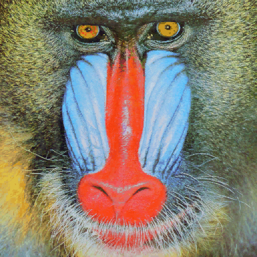

# Práctica 2. Funciones básicas de OpenCV

A continuación se describe el desarrollo de la práctica por parte de los miembros del grupo 21.

Para la resolución de las distintas tareas se ha realizado un desglose en subtareas más simples para una mejor comprensión de las soluciones desarrolladas.

## Tarea 1. Realiza la cuenta de píxeles blancos por filas (en lugar de por columnas). Determina el valor máximo de píxeles blancos para filas, maxfil, mostrando el número de filas y sus respectivas posiciones, con un número de píxeles blancos mayor o igual que 0.95*maxfil.

Esta tarea se puede desglosar en dos subtareas que se desarrollan a continuación con mayor detalle.

### Subtarea 1:

En primer lugar, buscar la fila con la mayor cantidad de píxeles blancos e indicar la cantidad y el índice de esa fila hallada:

Para esta primera subtarea se ha leído la imagen aportada en el cuaderno de la tarea (imagen 1):

Se comprueba que la imagen se ha leído correctamente y se convierte a una escala de grises (``cv2.COLOR_BGR2GRAY``).

A continuación, se hace uso del método Canny (``cv2.Canny()``) para hallar los contornos con umbral relativo 100 y umbral absoluto 200.

Y con el resultado de esta operación, se procede a contar el número de píxeles blancos por filas y guardar el resultado de la operación para ser normalizado más adelante.

Finalmente se muestran los resultados observables tanto en la imagen como a través de un histograma (imagen 2): 

### Subtarea 2:

En segundo lugar, sabiendo la cantidad máxima de píxeles blancos en una fila (siendo esta 220 píxeles), se calcula el 95% de esta cantidad para hallar el número de filas que contienen esta cantidad o más.

El 95% de 220 es 209. Buscando con una función lambda aquellas filas que cumplan este valor se confirma que hay dos lineas con el 95% o más píxeles blancos del máximo que hay en la imagen.

## Tarea 2: Aplica umbralizado a la imagen resultante de Sobel (convertida a 8 bits), y posteriormente realiza el conteo por filas y columnas similar al realizado en el ejemplo con la salida de Canny de píxeles no nulos. Calcula el valor máximo de la cuenta por filas y columnas, y determina las filas y columnas por encima del 0.95*máximo. Remarca con alguna primitiva gráfica dichas filas y columnas sobre la imagen. ¿Cómo se comparan los resultados obtenidos a partir de Sobel y Canny?

Se procede a realizar la tarea 2 con la misma imagen de la tarea anterior (imagen 1).

### Subtarea 1:

Para emprezar, se genera una imagen de Sobel (``cv2.Sobel()``) y se transforman los valores a 8 bits (``cv2.convertScaleAbs()``). Ha de aclararse que por las pruebas realizadas, se cree mejor opción usar el método mencionado anteriormente en vez de la versión de la librería _numpy_ (``np.uint8()``). La imagen resultante de la operación sobel (imagen 3).

### Subtarea 2:

La imagen obtenida en la subtarea anterior es umbralizada con el método ``cv2.treshold()`` asignando umbral relativo 100 y umbral absoluto 255. El resultado se puede observar en la imagen 4.

### Subtarea 3:

Se realiza el mismo procedimiento que en la práctica anterior, contando el número de píxeles blancos por fila y columna. El resultado se muestra en los histogramas a continuación (imagen 5).

### Subtarea 4:

Se halla las cantidades máximas y mínimas de píxeles blancos por filas/columnas, así como las filas que contienen este número de píxeles (véase imagen 6).

### Subtarea 5:

Finalmente, se muestra en pantalla la imagen, marcando aquellas filas y columnas que cumplen las condiciones indicadas en la subtarea anterior a partir de un bucle para cada orientación, filas y columnas (imagen 7).

## Tarea 3: Proponer un demostrador que capture las imágenes de la cámara, y les permita exhibir lo aprendido en estas dos prácticas ante quienes no cursen la asignatura :). Es por ello que además de poder mostrar la imagen original de la webcam, incluya al menos dos usos diferentes de aplicar las funciones de OpenCV trabajadas hasta ahora.

Para la realización de esta tarea se ha capturado la cámara y propuesto 4 modos distintos de visualización a elegir por el usuario.

El primer filtro se trata del pop art desarrollado durante la práctica anterior (imagen 8). Para más información, acudir al [readme de la práctica 1.](/Practica_1/Practica1.md)

El segundo filtro desarrollado hace uso de lo desarrollado a lo largo de esta misma práctica, aplicando Sobel y marcando con lineas azules las filas y columnas con mayor número de píxeles blancos y con lineas rojas las que menor cantidad tienen, las cuales se calculan frame a frame

Para el tercer filtro se invierten los colores captados por la cámara, esto es posible gracias al operador ``cv2.bitwise_not``, que como actuando como puerta lógica, invierte los valores que se le envían. Véase la imagen 10.

Finalmente, el cuarto filtro al que llamamos _"Efecto Matrix"_ es una implementación de **motion blur**, que muestra un leve desenfoque al captar movimiento. 

Esto es posible generando una máscara que al aplicarse sobre cada frame diferencia entre el objeto en movimiento y el fondo (_background_). Gracias a una de las operaciones que puede realizarse con OpenCV, ``cv2.createBackgroundSubtractorMOG2()`` se crea una máscara para obtener el fondo y muestra la imagen tras la transformación, como se observa en la imagen 11.

## Tarea 4: Tras ver los vídeos [My little piece of privacy](https://www.niklasroy.com/project/88/my-little-piece-of-privacy), [Messa di voce](https://youtu.be/GfoqiyB1ndE?feature=shared) y [Virtual air guitar](https://youtu.be/FIAmyoEpV5c?feature=shared) proponer un demostrador reinterpretando la parte de procesamiento de la imagen, tomando como punto de partida alguna de dichas instalaciones. 

Se propone un detector de colores, en este caso detector de tonalidades de rojo. Para ello se ha transformado la imagen leída por cv2 a formato HSV.

A continuación se ha establecido unos límites superiores e inferiores. Se guardan como máscaras y se combinan. Gracias una vez más a uno de los operadores de OpenCV, en este caso ``cv2.bitwise_and`` se aplican las máscaras para los valores indicados y se dibuja un rectángulo para ubicar esos espacios en tiempo real (imagen 13).

