# Práctica 3. Detección y reconocimiento de formas

A continuación se describe el desarrollo de la práctica por parte de los miembros del grupo 21.

Para la resolución de las distintas tareas se ha realizado un desglose en subtareas más simples para una mejor comprensión de las soluciones desarrolladas.

## Tarea 1: Captura una o varias imágenes con monedas no solapadas. Tras visualizar la imagen, identifica de forma interactiva (por ejemplo haciendo clic en la imagen) una moneda de un valor determinado en la imagen (por ejemplo de 1€). Tras ello, la tarea se resuelve mostrando por pantalla el número de monedas y la cantidad de dinero presentes en la imagen. No hay restricciones sobre utilizar medidas geométricas o de color. ¿Qué problemas han observado?

Esta tarea se puede desglosar en 2 subtareas, las cuales se muestran a continuación:
1. Visualizar la imagen e identificar una moneda de la imagen.
2. Mostrar por pantalla el número de monedas y cantidad de dinero presente en la imagen.

### Subtarea 1: 

Aquí hemos propuesto dos alternativas para visualizar la imagen e identificar una moneda de la imagen. 

La primera es utilizar la función de CV2 ``findContours()`` que es una función capaz de encontrar contornos para cualquier tipo de forma geométrica.

Para este proceso se siguen los siguientes pasos:
- Se realiza una conversión a RGB con ``cv2.COLOR_BGR2RGB`` y a continuación se realiza la conversión a tonos de grises con ``cv2.COLOR_RGB2GRAY``.
- Con  la escala de grises se realiza un umbralizado binario invertido con ``cv2.THRESH_BINARY_INV``. Como se ve en la imagen 1. 

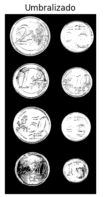

- Y por último se usa la función ``findContours()`` para conseguir los contornos que se encuentren en la imagen. También se puede pintar estos contornos sobre la imagen original para poder ver con más claridad donde ha encontrado los contornos.

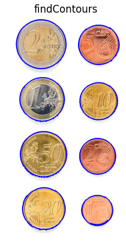

La segunda opción es la Transformada de Hough, que es la que hemos decidido utilizar porque nos a ofrecido mejores resultados.

Para utilizarlas se sigue el siguiente proceso:
- Se realiza un reescalado de la imagen si este fuese necesario haciendo uso de ``cv2.INTER_CUBIC``.
- Se realiza directamente un conversión a la escala de grises desde BGR utilizando ``cv2.COLOR_BGR2GRAY``.

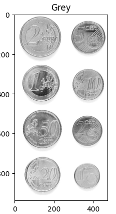

- Y se realiza un suavizado utilizando ``cv2.GaussianBlur()`` para que los posibles círculos interiores de las monedas estén más difuminados. 
- Se usa ``cv2.GaussianBlur()`` en vez de ``cv2.medianBlur()`` ya que la documentación de ``cv2.HoughCircles`` lo recomienda y hemos visto que da mejores resultados.

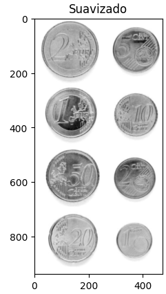

- Una vez hecho los pasos anteriores se usa ``cv2.HoughCircles()``, con el método `cv2.HOUGH_GRADIENT_ALT` como el tipo de detección, para hallar los círculos. Se usa el método **ALT** ya que es un método más nuevo y más preciso.
- A continuación se hace uso de unos bucles **for** para filtrar y excluir los círculos concéntricos que se puedan haber generado.
- Cuando ya se han filtrado se dibujan sobre la imagen original para poder visualizarlos.

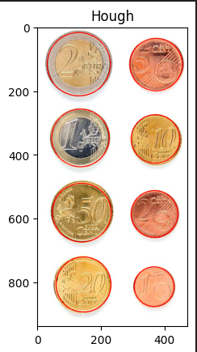

### Subtarea 2:

Para esta subtarea se quiere proceder a clasificar las monedas por diámetro y ratio entre las que se hayan detectado por el método de la Transformada de Hough.

- En primer lugar ordenamos los círculos que hemos obtenido de mayor a menor basandonos en el radio, utilizando ``sorted()``.
- Lo siguiente es que definimos los diámetros de las monedas en una la lista ``monedas[]`` y los métodos ``show_data()``, ``callback_mouse()``, ``classify()`` y ``close_val``.
- Utilizando los métodos definidos previamente y marcando en la imagen que moneda en la de **1 Euro** podremos realizar una comparativa para saber que monedas hay en la imagen.

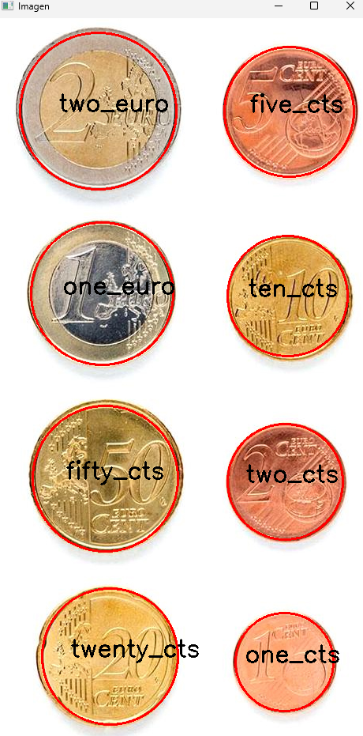

### ¿Qué problemas se han observado?

Durante la realización de la tarea 1 se ha observado un error consistentemente, el cual es cuando la imagen que se quiere analizar contiene sobras muy oscuras alrededor de las monedas. Esto supone un problema ya que puede hacer que el algoritmo, tanto el ``findContours()`` como el ``HoughCircles()`` se confundan haciendo que los círculos que detectan son más grandes de lo que deberían. 
Esto puede afectar a los ratios durante la comparativa, dando lugar a falsos positivos.

## Tarea 2: Las tres imágenes cargadas en la celda inicial, han sido extraidas de las imágenes de mayor tamaño presentes en la carpeta. La tarea consiste en extraer características (geométricas y/o visuales) e identificar patrones que permitan distinguir las partículas de cada una de las tres clases, evaluando los aciertos y fallos con las imágenes completas considerando las métricas mostradas y la matriz de confusión. La matriz de confusión, muestra para cada clase el número de muestras que se clasifican correctamente de dicha clase, y el número de muestras que se clasifican incorrectamente por cada una de las otras dos clases.

Esta tarea se descompondrá en 3 subtareas. Siendo estas las siguientes: 
1. Identificar la mayor cantidad de fragmentos, pellets y restos de alquitrán a partir de las imágenes disponibles (aquellas con mayor cantidad de objetos posible).
2. Extraer las características de los elementos identificados.
3. Usar los elementos para entrenar un modelo simple de clasificación con scikit-learn.

### Subtarea 1:

La subtarea 1 se puede dividir en tres partes. La identificación de contornos dentro de una imagen de microplásticos, de pellets y de alquitrán.
Para los tres casos se seguirá el mismo proceso pero se cambiará la imagen de referencia.

- Se convierte la imagen a una escala de grises haciendo uso de ``cv2.COLOR_BGR2GRAY``.
- Se realiza un suavizado utilizando ``cv2.medianBlur()``.
- Se realiza una umbralización adaptativa con la función ``cv2.adaptiveThreshold`` y los parámetros ``cv2.ADAPTIVE_THRESH_MEAN`` y ``cv2.THRESH_BINARY_INV``.
- A continuación se usa ``cv2.findContours()`` para filtrar los contornos y eliminar ruido y falsos positivos.
- Se realiza un descarte de cualquier objeto que sea menor a 100 píxeles, esto se realiza porque las imágenes proporcionadas tienen una gran cantidad de ruido. Este valor se deberá ajustar para poder ser usado en otras imagenes, la razón por la escogimos descartar todo lo que tenga menos de 100 píxeles es porque la imagen es de más de 4000 píxeles por más de 3000 píxeles.
- Lo siguiente es dibujar los contornos sobre la imagen original.

#### Contornos Microplásticos:

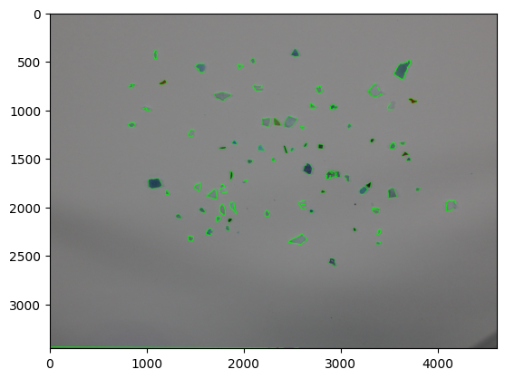

#### Contornos Pellets:

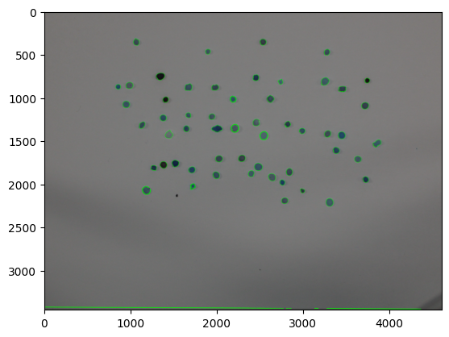

#### Contornos Alquitrán:

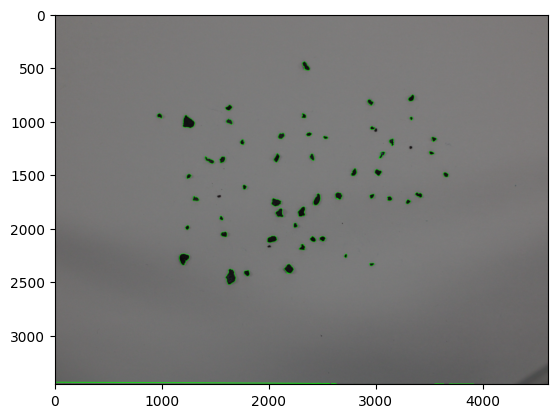

### Subtarea 2:

En la subtarea 2 se procederá a extraer varias carácterísticas comunes de los contornos para poder realizar la matríz de confusión.

Se crea un método ``features()`` en el que se extraerán y empaquetarán las siguientes características:
- Los momentos de Hu usando ``cv2.HuMoments()``.
- El área y el perímetro, con ``cv2.contourArea()``, ``cv2.arcLength()``.
- La relación área-perímetro.
- El *Bounding Rectangle*, con ``cv2.boundingRect()`` para obtener la relación altura-anchura.
- El Centroide y las distancias del centroide a los bordes.

Utilizamos este método con los contornos de los micropláticos, los pellets y el alquitrán. Luego los organizamos para poder generar la matríz de confusión.

Para la matríz de confusión hacemos uso de la librería ``sklearn`` y creamos un bucle en el que se ralizan los siguientes pasos:
- Dividimos los datos en entrenamiento y prueba.
- Definimos y enttrenamos un clasificador **MLP** haciendo uso de ``MLPClassifier()``.
- Predecimos en el conjunto de prueba y comprobamos la precisión, si el la mayor hasta el momento la guardamos.
- Volvemos a dividir los datos en entrenamiento y prueba, pero con la mejor semilla.
- Volvemos a definir y entrenar el clasificador **MLP** con la mejor semilla, y predecimos con el conjunto de prueba.

A continuación imprimimos los datos para evaluar el rendimiento:

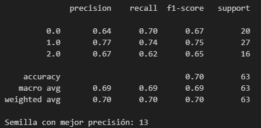

E imprimimos la matríz de confusión.

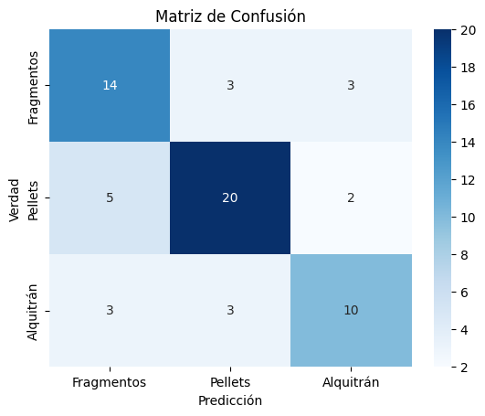
