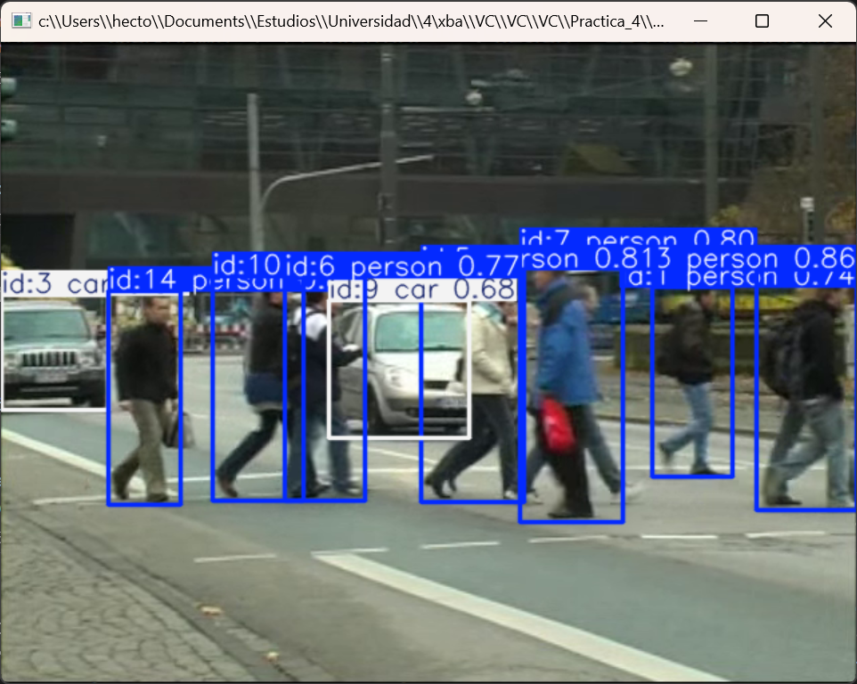
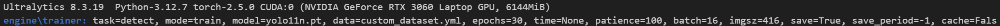
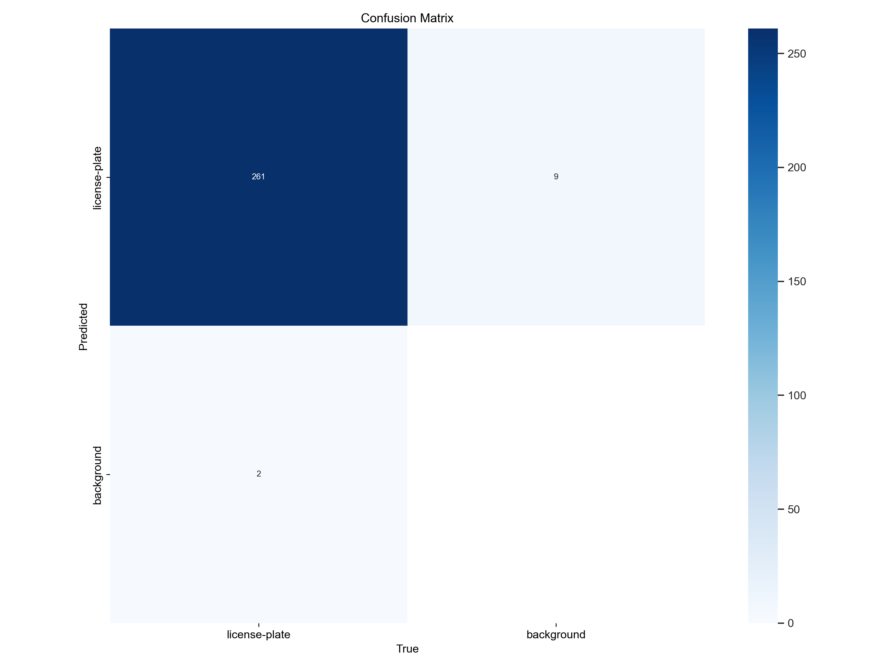
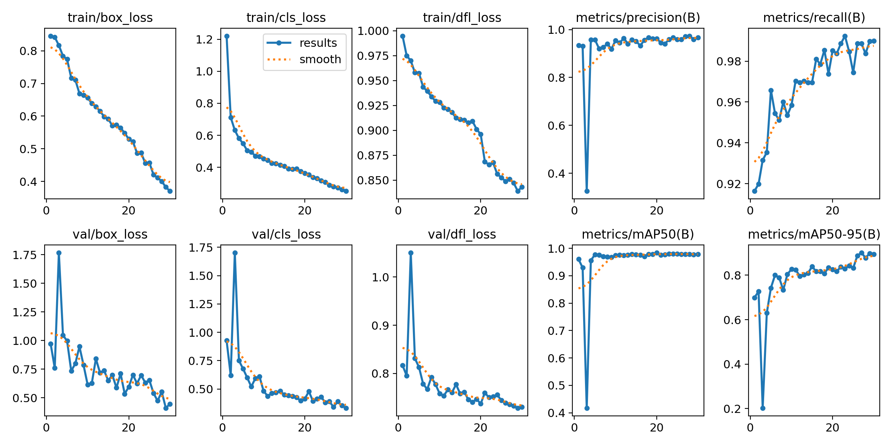

# Práctica 4. Reconocimiento de matrículas

A continuación se describe el desarrollo de la práctica por parte de los miembros del grupo 21.

Para la resolución de las distintas tareas se ha realizado un desglose en subtareas más simples para una mejor comprensión de las soluciones desarrolladas.

## Tarea:

Para la entrega de esta práctica, la tarea consiste en desarrollar un prototipo que procese uno (vídeo ejemplo proporcionado) o varios vídeos (incluyendo vídeos de cosecha propia):
- detecte y siga las personas y vehículos presentes
- detecte y lea las matrículas de los vehículos presentes
- cuente el total de cada clase
- vuelque a disco un vídeo que visualice los resultados
- genere un archivo csv con el resultado de la detección y seguimiento. Se sugiere un formato con al menos los siguientes campos:

        fotograma, tipo_objeto, confianza, identificador_tracking, x1, y1, x2, y2, matrícula_en_su_caso, confianza, mx1,my1,mx2,my2, texto_matricula

La entrega del cuaderno o cuadernos se hace efectiva a través del campus virtual por medio de un enlace github. Además del archivo README, debe incluirse el resultado del vídeo proporcionado como test (o enlace al mismo), y el correspondiente archivo csv. En el caso de entrenarse algún detector, por ejemplo de matrículas, debe proporcionarse acceso al conjunto de datos.

Se considerarán extras:
- Determine el flujo de personas y vehículos en el vídeo de test en distintas direcciones (vehículos que dejan la imagen por la derecha, por la izquierda, etc.)
- Participar en
- Evaluar dos alternativas para la detección de matrículas: basada en YOLO, y basada en contornos.
- Anonimizar a las personas y vehículos presentes en un vídeo.

## Desarrollo:

Lo primero que se realizará es la demostración del modelo de yolo que se va a usar como base, *Yolo11n*.
Para ello se hará uso del comando ```model.track()`` el cual nos permite usar el modelo permitiendo que yolo realice un seguimiento de los objetos que se están detectando. Ver imagen 1.



Con esto hemos podido confirmar que este modelo de yolo incluye las clases que necesitamos para la realización de la práctica: *persona, coche, moto y autobús*. Que son los tipos de vehículos más habituales en la carretera.

Lo siguiente que vamos a hacer, es entrenar un modelo para que detecte las matrículas de los coches. Esto nos permitirá recortar esa porción de la imagen y con un software de detección de texto, conseguiremos extraer la matrícula. 
Para ello hemos buscado un dataset de acceso público que ya viene etiquetado y organizado especificamente para ser usado para el entrenamiendo de un modelo tipo yolo.
https://universe.roboflow.com/lemons/registrringsnummer/dataset/12

Con el dataset y el comando ``model.train()`` vamos a proceder a entrenar. El ordenador donde ha sido entrenado el modelo cuenta con una GPU compatible con la tecnología CUDA y cuDNN de Nvidia, lo que nos permite entrenar el modelo en aproximadamente unos 15 minutos. Usando las especificaciones que se muestran en la imagen 2.



Al final de las 30 epocas de entrenamiento acabamos con un modelo con una precisión del 0.894. Y que nos da una matriz de confusión como se observa en la imagen 3.



Y el entranamiento muestra unos resultados como los que se observan en la imagen 4, que se pueden observar en las gráficas que en el entrenamiento se sigue una forma casi logarítmica en la que se puede suponer que no ha memorizado patrones y que el modelo ha aprendido correctamente. 



Una vez ya tenemos los dos modelos necesarios para la realización de la práctica procedemos:

- Lo primero es cargar los modelos de yolo ``yolo11n.pt`` y ``runs/detect/train3/weights/best.pt`` junto con la ruta del ejecutable de Tesseract OCR, que es el software de detección de texto que usaremos.
- A continuación creamos un contenedor para resultados que nos permitirá crear el CSV más adelante. También prepararemos el video de entrada y la configuración para el video de salida.
- Se prepararán unos contadores y una función para modificarlos, lo que nos permnitirá contabilizar la cantidad de objetos de cada clase que aparecen en el video.
- Una vez en el bucle principal iremos usando el modelo en cada frame del video acotando las búsquedas a *persona, coche, moto y autobús*. 
- Para los resultados de cada frame, los analizamos para diversos motivos:
- Si el objeto detectado es una persona, se aplicará un desenfoque en todo el "bounding box" para anonimizar a la persona.
- Si el objeto es un coche y la confianza es superior a 0.7 se procederá a recortar el "bounding box" del coche para pasarselo a el modelo de detección de matrículas ``det_plates()``.
- Para cada uno de los resultados de la búsqueda de matrículas recortaremos su "bounding box", comprobaremos que no esté vacío y que tenga las dimensiones válidas para después pasarlo a una escala de grises y obtener sus contornos con ``cv2.Canny()``.
- Los contornos los tratamos con Tesseract OCR haciendo uso de la función ``pytesseract.image_to_string()`` y el resultado lo tratamos con una expresión regular para asegurarnos de que cumple con la estructura de una matrícula.
- Por último anonimizamos la matrícula realizando un desenfoque en todo su recorte.
- A continuación realizamos una visualización del "bounding box" y del texto de la matrícula.
- Una vez fuera del bucle realizamos un ``print()`` de varios datos importantes como la confianza y la clase. Esto nos permite saber que el código está funcionando.
- También realizamos una actualización de los contadores y realizamos un ``detections_data.append()`` para poder crear un dataframe para nuestro archivo CSV.
-  Una vez ha terminado el bucle principal realizamos un ``print()`` de los contadores, volcamos el video a disco y pasamos nuestro dataframe a un archivo CSV.